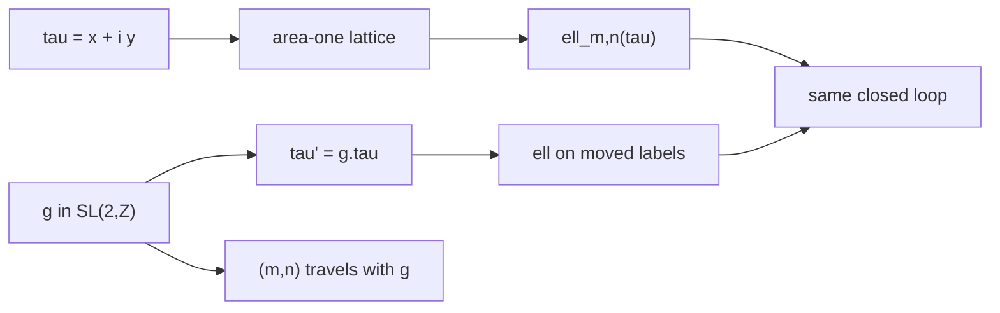

# Map

Caption: a basis change is not a shape change. Comparing the same integer
labels after g is not comparing the same trajectory. Jacobi fields live in
the companion testbed. Lengths are not SP1 guests.
